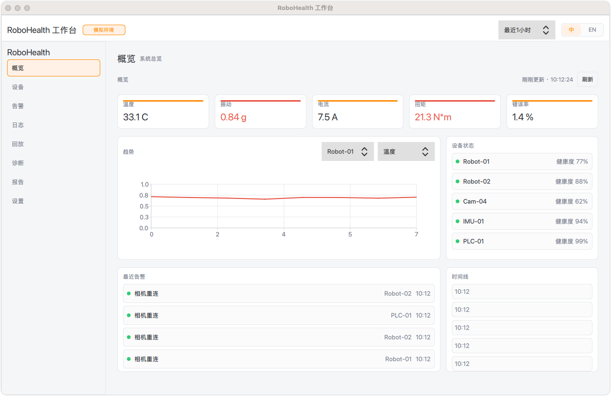
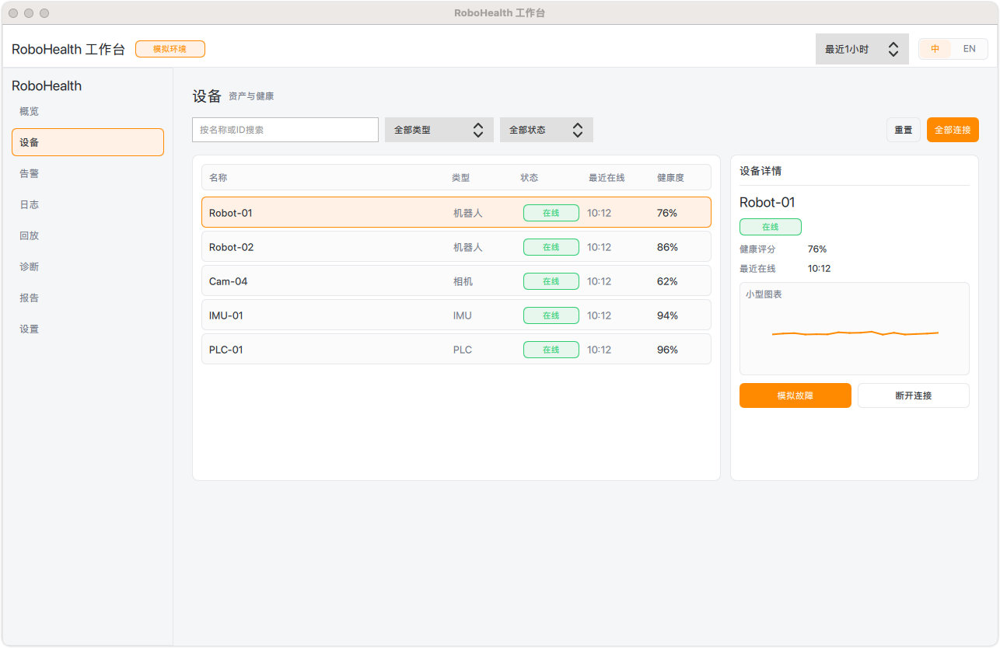
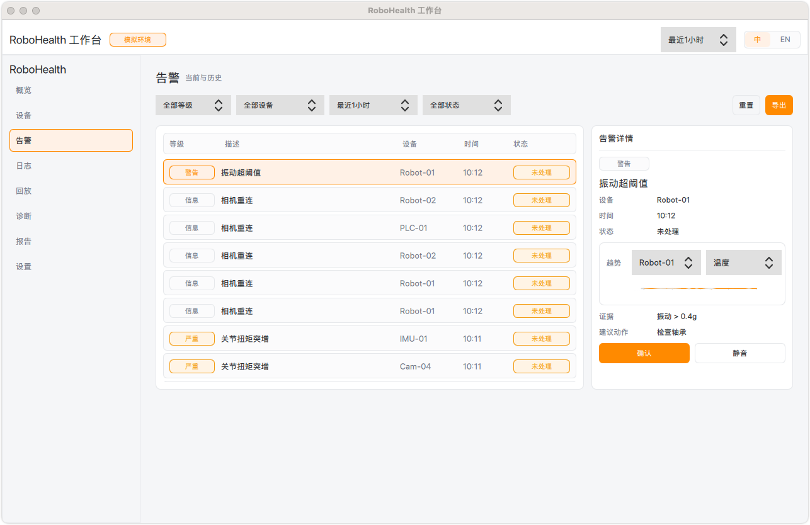
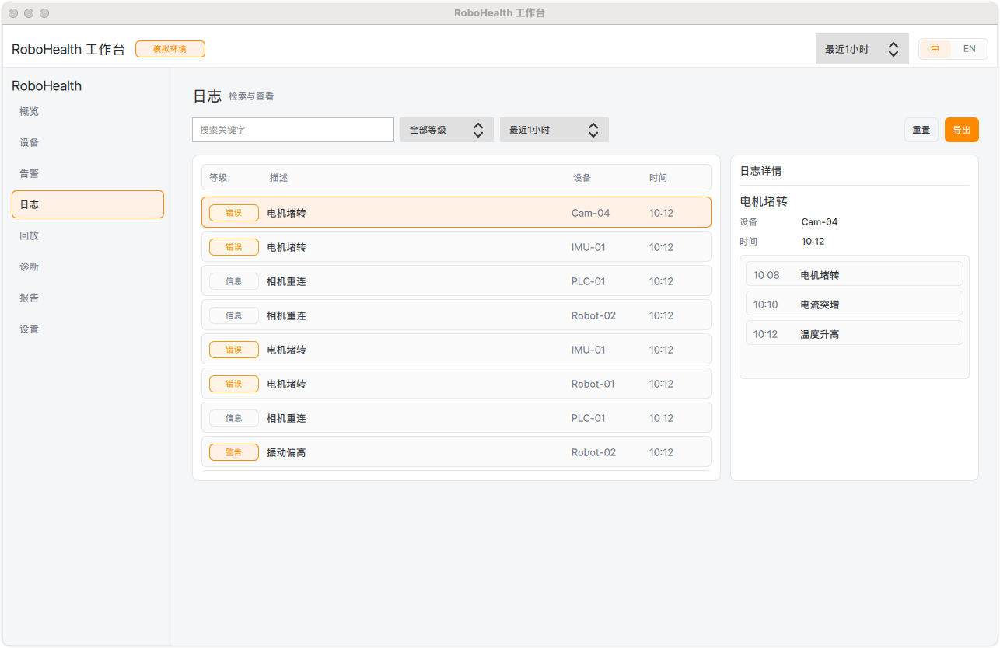
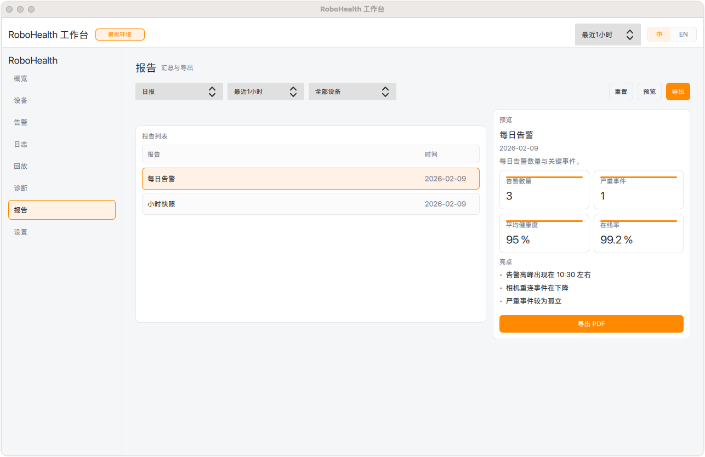
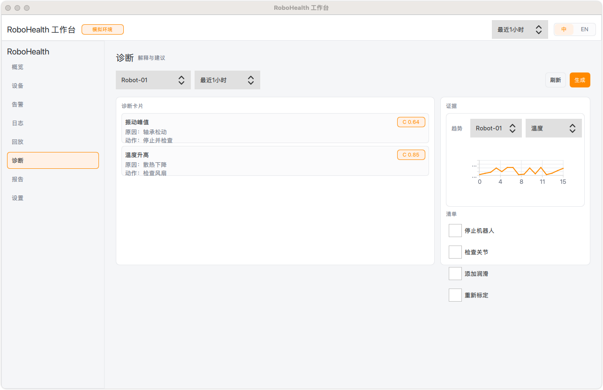
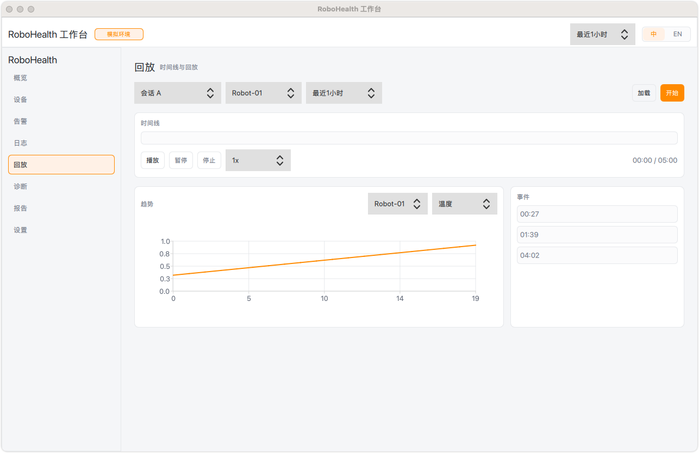
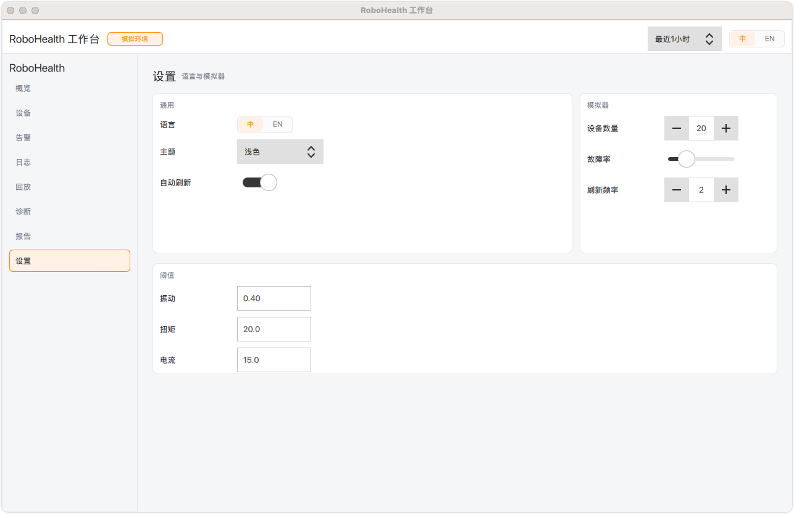
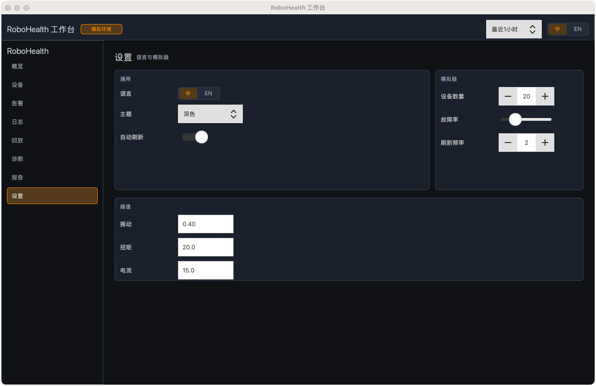

# RoboHealth Studio

RoboHealth Studio is a Qt 6 desktop app for monitoring industrial robots and edge devices. It combines a rich QML UI with a clean C++ MVVM layer and a .NET simulator backend (REST + gRPC) so the full experience can run without real hardware.

## Why it stands out (interview focus)
- End-to-end delivery: UI + business logic + simulated backend + exports
- Clear architecture boundaries (QML UI / C++ ViewModels / service adapters)
- Realistic data flow (REST polling, ack/mute actions, reports & diagnostics)
- Production-minded UX: filters, detail panels, empty states, exports

## Features
- Live dashboard with health KPIs and trend charts
- Device management (connect/disconnect/simulate faults)
- Alerts center with acknowledge/mute actions
- Logs explorer with filters and contextual detail
- Diagnostics and replay views with mock analytics
- Reports with CSV + mock PDF export
- REST + gRPC simulator to generate realistic data

## Screenshots

### Overview


### Core Modules

| Devices | Alerts |
| --- | --- |
|  |  |

| Logs | Reports |
| --- | --- |
|  |  |

| Diagnostics | Replay |
| --- | --- |
|  |  |

### Settings (Light / Dark)

| Light | Dark |
| --- | --- |
|  |  |

## Architecture

```
QML UI  ->  C++ ViewModels  ->  Telemetry Service (Mock or REST)
                                      |
                                      v
                            .NET Simulator (REST + gRPC)
```

### Architecture Highlights
- Clear separation of concerns: QML for presentation, C++ ViewModels for state, services for data access.
- Pluggable data source: `TelemetryServiceBase` allows switching between Mock and REST at runtime.
- REST polling drives real-time updates (metrics/logs/alerts), while actions (ack/mute/connect) go back to the service.
- Reports/diagnostics/replay can fetch from REST, with local fallbacks to keep UI responsive.
- Export pipeline supports CSV/PDF mock generation from backend, keeping UI thin.

### Key Layers
- UI Layer (QML): pages, components, theming, and i18n state.
- Presentation Layer (C++ ViewModels): state management, filtering, and UI-ready data shaping.
- Integration Layer (Telemetry services): Mock generator and REST adapter.
- Simulator Service (.NET): REST + gRPC endpoints, data synthesis, and export endpoints.

### Data Flow
1. UI triggers ViewModel actions (filters, selections, commands).
2. ViewModel delegates to Telemetry service (Mock or REST).
3. REST adapter polls backend for devices/alerts/logs/metrics.
4. ViewModel updates models; QML reacts through bindings.

### Architecture Decisions & Trade-offs
- MVVM in C++: keeps QML declarative and thin, while making state and logic testable and reusable.
- Polling vs. push: REST polling is simple, reliable for demos, and easy to swap with streaming later.
- Service abstraction (`TelemetryServiceBase`): enables rapid iteration and deterministic mock data without blocking UI work.
- Export in backend: keeps UI free of heavy formatting logic; backend can evolve to real CSV/PDF later.

### Scalability, Performance, and Testing
- Scalability: service boundary makes it easy to replace simulator with real telemetry (REST/gRPC/streaming).
- Performance: QSortFilterProxyModel-based filtering keeps UI responsive with large lists.
- UI rendering: lightweight QML components + deferred detail panels avoid unnecessary recomputation.
- Testing: ViewModels are isolated from UI and can be unit-tested with mock services.

## Tech Stack
- Qt 6 (QML, Widgets, Charts, Network)
- C++17 (MVVM-style ViewModels)
- .NET 8 (Simulator service)
- CMake

## Quick Start

### Prerequisites
- Qt 6.10+
- CMake 3.20+
- .NET 8 SDK

### Build

```bash
cmake -S . -B build
cmake --build build
```

### Run (Mock backend)

```bash
./build/app/robohealth-studio
```

### Run (Simulator REST backend)

```bash
dotnet run --project simulator/RoboHealth.Simulator
ROBOHEALTH_BACKEND=rest ./build/app/robohealth-studio
```

Override API base URL if needed:

```bash
ROBOHEALTH_API_URL=http://127.0.0.1:5000 ROBOHEALTH_BACKEND=rest ./build/app/robohealth-studio
```

## Simulator REST Endpoints
- `GET /api/health`
- `GET /api/devices`
- `POST /api/devices/connectAll`
- `POST /api/devices/disconnectAll`
- `POST /api/devices/{id}/disconnect`
- `POST /api/devices/{id}/simulateFault`
- `GET /api/metrics`
- `GET /api/alerts`
- `POST /api/alerts/{id}/ack`
- `POST /api/alerts/{id}/mute`
- `GET /api/logs`
- `GET /api/reports`
- `GET /api/diagnostics`
- `GET /api/replay`
- `GET /api/exports/alerts`
- `GET /api/exports/logs`
- `GET /api/exports/reports`
- `GET /api/exports/reportPdf`

## Repository Layout
- `app/`            C++ app entry point
- `ui/`             QML pages and UI components
- `presentation/`   ViewModels and UI state
- `domain/`         Business rules and interfaces
- `data/`           Repository implementations
- `integration/`    Device adapters (Mock/REST)
- `infrastructure/` Logging, config, i18n
- `simulator/`      .NET simulator service
- `docs/`           Screenshots and notes

## Notes
This project is built to demonstrate an end-to-end desktop workflow, with a realistic data pipeline and UX features that resemble production monitoring tools.
